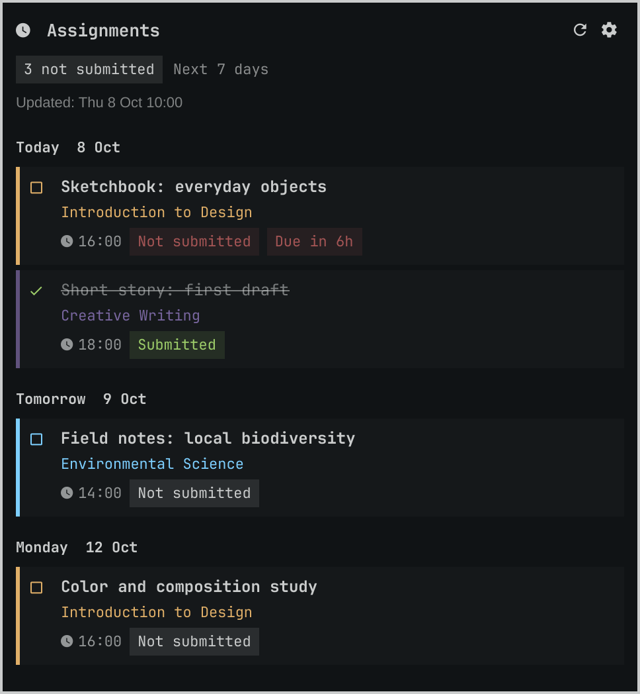
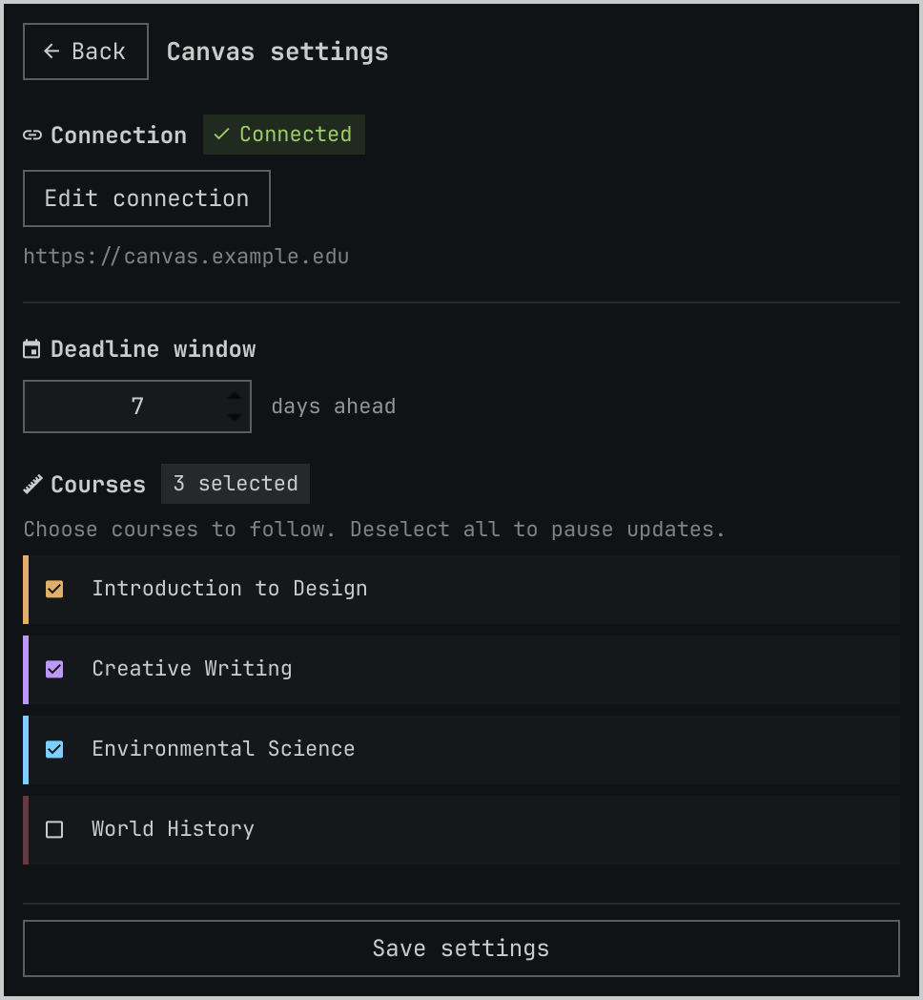

# Omarchy Canvas

Keep upcoming Canvas assignments in your Omarchy bar. This read-only plugin shows an agenda for the courses you choose, counts assignments marked **Not submitted**, and opens assignment pages in your browser.

The default deadline window is seven days ahead. You can change it to 1–90 days in Settings. The plugin uses Python's standard library; no pip packages are needed.

## Screenshots

Both screenshots use **fictional template data only**. Course names, assignments, dates, and the Canvas site are examples. No personal courses, account details, or real access tokens are included. These are offscreen captures of the plugin's QML pages with an isolated sample-data helper; appearance follows the Omarchy shell's default styling.

### Assignment agenda — first page



### Settings page



## Contents

- [Requirements](#requirements)
- [Installation](#installation)
- [First-time setup](#first-time-setup)
- [Everyday use](#everyday-use)
- [Settings and reconnecting](#settings-and-reconnecting)
- [Deadlines and submission status](#deadlines-and-submission-status)
- [Refreshes and failures](#refreshes-and-failures)
- [Privacy and read-only access](#privacy-and-read-only-access)
- [Updating and removing](#updating-and-removing)
- [Troubleshooting](#troubleshooting)
- [Development](#development)
- [License](#license)

## Requirements

- **Omarchy with the Quattro shell**, including the `omarchy plugin` commands and Quickshell.
- **Python 3**, available as `python3`.
- **A Canvas HTTPS site** and a personal access token allowed to read your courses and assignments. Your institution must allow token creation.
- **Active student enrollments** in the courses you want to follow.
- **A default browser** logged into Canvas to open assignment links. The browser session is separate from the API token.

This is an Omarchy shell plugin, not a standalone desktop application.

## Installation

Install and enable the plugin:

```sh
omarchy plugin add https://github.com/GnussonNet/omarchy-canvas.git --enable
```

The widget defaults to the right section of your existing bar. To place it there explicitly:

```sh
omarchy bar move gnussonnet.omarchy-canvas --section right
```

The plugin ID is `gnussonnet.omarchy-canvas`. On a top bar, the right section is at the top right; installing the plugin does not change the bar's position.

## First-time setup

### 1. Create a Canvas access token

In Canvas, open **Account → Settings → Approved Integrations → New Access Token**. Create a token and copy it for the next step. If the option is missing, ask your institution whether personal API tokens are available.

### 2. Connect the plugin

1. Click the clock/deadline widget in the bar. Before setup, it displays **Setup**.
2. Click the **settings gear**, or **Connect Canvas and choose courses**.
3. Enter your Canvas site root, such as `https://school.instructure.com`. Do not paste a course URL, login URL, or `/api/v1` path. HTTP URLs are not accepted.
4. Paste your token into the masked **Access token** field.
5. Click **Connect**. The plugin checks access and loads your active student courses before saving the connection.

The **Token help** button also explains where to create a token. No terminal credential command is required.

### 3. Choose courses and save

1. Set **days ahead** to a whole number from **1 to 90**; the default is **7**.
2. Select the courses to include in the agenda.
3. Click **Save settings** at the bottom. The plugin returns to the agenda and fetches assignments.

**Connect** saves the connection and course list. **Save settings** confirms your selection and starts assignment fetching. You need both steps on a new connection. You can save with no courses selected to pause assignment fetching.

## Everyday use

Click the bar widget to open the assignment agenda. Assignments are sorted by deadline and grouped by local date. Colored markers identify courses; badges show submission status and deadlines approaching within 24 hours.

| Control | Action |
| --- | --- |
| Assignment row | Open that assignment in the default browser |
| Refresh button | Fetch assignments again |
| Settings gear | Open connection, deadline, and course settings |
| Up / Down | Select an assignment |
| Enter | Open the selected assignment |
| R | Refresh assignments |
| Escape | Close the panel |
| Click outside | Close the panel |

Submitted assignments stay visible, with their titles struck through. The bar counter counts only rows whose status is **Not submitted**; it is not the total number of visible assignments or every kind of unfinished work.

The bar shows **Setup** when configuration is needed, **!** for a refresh error, or a count followed by **!** when the result has warnings. Open the panel to read the details.

## Settings and reconnecting

Open the agenda and click the settings gear whenever you want to change the deadline window or course selection.

- Click course rows to select or deselect them. Focused course rows also toggle with **Space** or **Enter**.
- Click **Save settings** to apply the course selection and deadline window.
- Click **Back** to return without saving those edits.
- The course list scrolls when necessary; Back and Save settings remain accessible.

After connection, the credential form collapses. Click **Edit connection** to change the site or token, or to reconnect and reload the course list.

For the same site, leave the token field blank to keep the saved token. Changing the site requires a token. **Connect** only replaces saved credentials after the course list loads successfully, so a failed connection check preserves the previous configuration.

Reconnecting with the same site and token preserves course choices that still exist. Changing the site or token resets the selection. Every successful reconnect requires clicking **Save settings** again to confirm courses and resume fetching. Returning with Back does not undo a connection already saved by Connect.

The course list is refreshed by **Connect**, not by routine assignment refreshes. Reconnect if a newly enrolled course is missing.

## Deadlines and submission status

### What appears in the agenda

The deadline window runs **from the current moment through the end of the local calendar day N days ahead**. For example, with seven days ahead on a Thursday, the agenda includes the rest of today and all of next Thursday. It is a calendar-day window, not exactly 168 hours.

Deadlines use the desktop's local timezone and Canvas's personalized assignment dates. The end boundary is local midnight after the final day, including daylight-saving changes. An assignment exactly at that midnight belongs to the following day and is excluded.

The agenda includes submitted work within the window. It excludes:

- Assignments already overdue or without a due date.
- Assignments marked unpublished or hidden from the student.
- Courses you have not selected; only active student courses are offered at connection time.

### Status labels

| Label | Meaning |
| --- | --- |
| Not submitted | Canvas supplies submission data without a submitted, graded, excused, or resubmission state |
| Submitted | Canvas reports a submission timestamp, submitted state, or pending review |
| Graded | Canvas reports graded work without evidence of an online submission |
| Excused | Canvas marks the submission excused |
| Resubmission requested | Canvas requests another submission |
| No online submission | The assignment uses an on-paper or no-submission type, without a higher-priority status |
| Unknown | Canvas supplies no submission data |

Statuses reflect what Canvas reports. **Graded** alone does not establish that an online submission was made. External-tool assignments depend on that tool reporting submission information back to Canvas.

Urgency badges appear for **Not submitted** and **Resubmission requested** work due within 24 hours. Time passing can make an existing row overdue before the next refresh; a successful refresh removes it from the agenda.

## Refreshes and failures

Assignments refresh on startup, after saving settings, every **five minutes**, and when you use Refresh or **R**. Opening the panel shows the current results immediately. Opening Settings cancels an ongoing assignment refresh.

Regular refreshes request assignments only for selected courses. They do not reload the course list or fetch assignments from unselected courses. With no courses selected, no assignment API calls are made.

Each HTTP request has a **20-second timeout**. Helper operations have a **60-second overall limit**.

- **Successful refresh:** replaces the agenda and updates its timestamp.
- **Some courses fail:** displays warnings and results from the successful courses. A failed course, including one whose pagination did not finish, contributes no assignments to that refresh.
- **All selected courses fail:** keeps the previous agenda and its timestamp, and reports an error. Those rows may be stale.
- **Connection or configuration failure:** shows an error; existing results may remain visible. Check the last successful refresh time before relying on them.

An empty agenda can mean there are no deadlines within the window, no courses are selected, or some courses could not be checked. The panel distinguishes these cases.

## Privacy and read-only access

### Canvas API access

The Python reader allows only these authenticated GET routes:

```text
GET /api/v1/courses
GET /api/v1/courses/:id/assignments
```

It uses an explicit query-parameter allowlist and requests submission information without `read_status`, which can mark submissions as read. It has no submit, upload, edit, delete, or grading operations.

Pagination must stay on the same HTTPS origin and requested API route. Redirects are refused. Assignment links are constructed from the configured site and course/assignment IDs.

A personal token may have broader permissions than the plugin uses. If your administrator supports scoped tokens, request read access to the two routes above. Opening assignments in your browser can generate normal Canvas page-view activity, and actions you take there are separate from the plugin.

### Local storage

Configuration is stored outside the repository at:

```text
$XDG_CONFIG_HOME/omarchy-canvas/config.json
```

When `XDG_CONFIG_HOME` is unset, this is `~/.config/omarchy-canvas/config.json`. It contains the site URL, token, course IDs and names, selected course IDs, selection confirmation, and deadline window.

The file is created with **0600** permissions and replaced atomically when settings are saved. The token is plain text, not encrypted; programs running as your user can read it. The reader refuses configuration files accessible to group or other users.

The saved token is never returned to QML. A newly entered token passes to Python through standard input, rather than command-line arguments, and is cleared from the form when sent or the panel closes. Helper responses do not include it, and it is not sent to the browser.

The plugin has no telemetry, persistent assignment cache, background service, installer hook, privileged command, or remote build. Assignment data stays in shell memory. Omarchy plugins run with your user permissions.

Do not include your token in commits, screenshots, shell commands, or issue reports.

## Updating and removing

### Update

```sh
omarchy plugin update gnussonnet.omarchy-canvas
```

If the plugin asks you to complete setup after updating, open Settings, connect if needed, choose courses, and click **Save settings**. Older configurations without a confirmed course selection require this step.

If the old interface remains loaded, restart the shell:

```sh
omarchy restart shell
```

This briefly restarts the bar and shell UI. It does not delete Canvas credentials.

### Remove

```sh
omarchy plugin remove gnussonnet.omarchy-canvas
```

Removal leaves the private configuration file intact. To remove account data too, delete `$XDG_CONFIG_HOME/omarchy-canvas/config.json` (normally `~/.config/omarchy-canvas/config.json`) and revoke the access token in Canvas if you no longer need it.

## Troubleshooting

| Symptom | What to do |
| --- | --- |
| Setup remains visible | Finish connecting, select courses, and click Save settings. Connecting alone does not start assignment fetching. |
| Token rejected or expired | Create a valid token in Canvas, then use Edit connection → Connect and save your course selection. |
| Access denied | Check that your token and institutional policy allow reading courses and assignments. Course-list access does not guarantee assignment access. |
| Unable to reach Canvas / redirected request | Check connectivity and the HTTPS site root. Use the institution's direct Canvas URL rather than a login redirect or course link. |
| Rate limit reached | Wait and try again later. |
| Request timed out | Check connectivity or select fewer courses before retrying. |
| Missing course | Reconnect to reload active student enrollments. Courses without an active student enrollment are not offered. |
| Missing assignment | Check the course selection, deadline window, publication/visibility, due date, and any course warnings. Overdue work is excluded. |
| Count differs from the number of rows | The count includes only Not submitted; submitted and other statuses can still appear in the agenda. |
| No courses selected | Choose courses in Settings and save, or leave the selection empty to keep fetching paused. |
| Credential file must be private | Restore owner-only permissions using the command shown in the error. For the default path: `chmod 600 ~/.config/omarchy-canvas/config.json`. |
| Canvas reader failed | Verify `python3` is installed and available to the shell; inspect the shell log. |
| Old panel or missing settings gear after update | Run `omarchy restart shell`. |

To inspect recent shell messages:

```sh
qs log -p /usr/share/omarchy/shell --tail 100
```

When reporting a problem, include the error message, plugin version, and steps to reproduce. Remove account details, tokens, and personal course data from logs or screenshots you share.

## Development

### Repository layout

| File | Purpose |
| --- | --- |
| `manifest.json` | Plugin identity, version, and bar-widget entry point |
| `BarWidget.qml` | Bar counter, periodic refreshes, and Python process handling |
| `Panel.qml` | Assignment agenda, navigation, and settings-page lifecycle |
| `Settings.qml` | Connection form, course selection, and deadline window |
| `CanvasTaskRow.qml` | Assignment presentation, status, and urgency |
| `CanvasBadge.qml`, `CanvasButton.qml`, `CanvasScrollBar.qml` | Shared plugin controls |
| `CanvasStyle.js` | Deterministic course colors |
| `canvas.py` | Allowlisted API reader, configuration storage, and JSON helper commands |
| `tests/test_canvas.py` | Unit tests with synthetic API responses |
| `docs/render-screenshots.py` | Isolated offscreen screenshot renderer with fictional data |
| `VALIDATION.md` | Recorded validation results and remaining interactive checks |

### Validate changes

From the repository root:

```sh
python3 -m unittest discover -s tests -v
omarchy plugin validate .
git diff --check
```

The unit tests never contact Canvas. They cover credentials, selected-course fetching, submission statuses, deadline boundaries and daylight-saving time, API restrictions, pagination, and failure handling.

For QML checks on Arch:

```sh
/usr/lib/qt6/bin/qmllint -I /usr/share/omarchy/shell \
  BarWidget.qml Panel.qml Settings.qml \
  CanvasTaskRow.qml CanvasBadge.qml CanvasButton.qml CanvasScrollBar.qml
```

Use `qmllint` directly if it is on your PATH. Quickshell's `qs.*` imports need an import root containing `qs` mapped to `/usr/share/omarchy/shell`; stock qmllint may otherwise report unresolved imports. Distinguish missing runtime/type metadata from QML syntax errors.

With the plugin installed, open and hide it through shell IPC:

```sh
omarchy-shell shell summon gnussonnet.omarchy-canvas '{}'
omarchy-shell shell hide gnussonnet.omarchy-canvas
```

Interactive checks should cover connection success/failure, text entry, selecting and saving courses, scrolling, browser links, keyboard navigation, outside-click dismissal, closing during helper operations, and plugin lifecycle. Mocked tests and screenshots do not verify a live Canvas account or the complete desktop flow; see [VALIDATION.md](VALIDATION.md).

### Python helper interface

The QML pages launch `canvas.py` directly. These modes are mutually exclusive:

| Invocation | Behavior |
| --- | --- |
| `python3 canvas.py` | Read local configuration and fetch selected-course assignments; makes live Canvas GET requests when configured |
| `python3 canvas.py --settings-info` | Return local settings as JSON without the token; no API request |
| `python3 canvas.py --save-settings` | Read a JSON line from stdin with `url`, `token`, and optional `days_ahead`; validate access, load courses, and save the connection |
| `python3 canvas.py --select-courses` | Read a JSON line from stdin with `url`, `selected_course_ids`, and optional `days_ahead`; save the selection locally |
| `python3 canvas.py --configure` | Legacy interactive credential-only setup with a hidden token prompt; refuses to overwrite an existing file |

The graphical settings flow is recommended. The legacy `--configure` mode does not load courses or confirm a selection, so graphical setup is still required afterward. JSON helper results use `ok` to indicate success; callers must inspect it, since handled API errors can return with exit code zero.

### Regenerate the screenshots

On a machine with Quickshell and the Omarchy shell installed at `/usr/share/omarchy/shell`:

```sh
python3 docs/render-screenshots.py
```

The renderer copies the plugin components into a temporary directory, replaces the Python helper with fixed fictional settings, and supplies fictional assignments. It uses a temporary home, config, data, cache, and runtime directory, renders with Qt's offscreen software backend, and saves only the two page images to `docs/screenshots/`.

The compositor-specific popup container is replaced with an offscreen card; page contents and controls use the actual QML. It does not capture the desktop, read your Canvas configuration, contact Canvas, or alter the installed plugin. Dates are fixed so the examples are reproducible.

### Distribution

Source: [GnussonNet/omarchy-canvas](https://github.com/GnussonNet/omarchy-canvas). Direct Git installation does not require a marketplace listing. Omarchy provides [plugin development](https://plugins.omarchy.org/develop.html) and [publishing](https://plugins.omarchy.org/publish.html) guides.

## License

[MIT](LICENSE).
